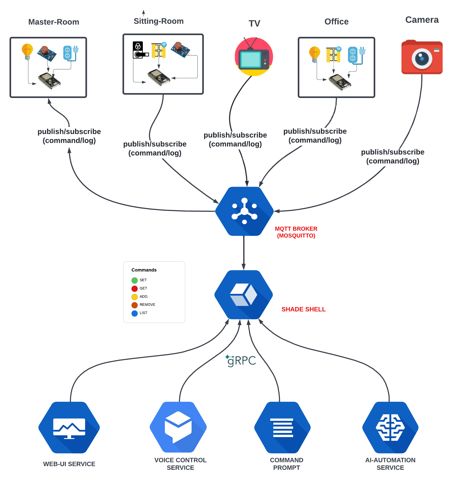

# SHA-DE (SMART HOME ASSITANT AND DIGITAL ECO-SYSTEM). 
I am on a mission to make my house smart, and I would be doing almost everything from scratch. Let's do this together, let's learn together.

### YOUTUBE TUTORIALS
https://youtube.com/playlist?list=PLQDvLS_MNLkf7i2TDSJD13QhRDkX_hE9F

### MAIN FEATURES:
1. WEB DASHBOARD
2. VOICE ASSITANT/CONTROL
3. COMMAND PROMPT
4. AI-POWERED AUTOMATION
